# GT-share
「楽器演奏者のための**楽曲レビューサイト**」です。\
ユーザーは演奏したことのある楽曲についてレビューを投稿することができます。\
評価が気になる楽曲について検索し、レビューを閲覧することも可能です。

#### 主な用途
- 気になる曲についての演奏のヒントを調べる
- 今の自分に演奏できそうな曲を探す
- 自分が練習した曲についてのメモや感想を記録する

#### 使用イメージ動画

https://user-images.githubusercontent.com/81407853/153855253-30309012-84a4-41df-87d5-3ad85bca0d4e.mp4

#### URL
https://gtshare.herokuapp.com

#### テスト用アカウント
メールアドレス: `t@t.tt`\
パスワード: `tttt1234`

## 作成した背景/目的

私は9年前にエレキギターを弾き始め、高校や大学でバンド活動を行ってきました。
初めは何をやれば上達できるか分からず挫折しそうになりました。
その状況を打破できたのは、バンドの先輩から演奏のコツなどを教えてもらったおかげだと実感しています。

この経験から、楽器を練習している人の手助けとなる情報を提供できるサービス作りのために、本アプリケーションを作成しました。

## 機能一覧
- [SPA構成](#SPA構成)
- [アーティスト名一覧表示](#アーティスト名一覧表示)
- [曲名一覧表示](#曲名一覧表示)
- [レビュー一覧表示](#レビュー一覧表示)
- [ユーザー登録・ログイン機能](#ユーザー登録ログイン機能)
- [ユーザーメニュー](#ユーザーメニュー)
- [ナビゲーションメニュー](#ナビゲーションメニュー)
- [ランキング機能](#ランキング機能)
- [いいねマイリスト](#いいねマイリスト)
- [自分の投稿一覧表示](#自分の投稿一覧表示)

### SPA構成
- 本アプリケーションはすべてSPA構成となっております。
- バックエンドはPHPとLaravel、フロントエンドはVue.jsを用いて開発しました。

### アーティスト名一覧表示
- クリックすると曲名一覧画面へ移動します。
- ヘッダーの項目をクリックして並び替えが可能です。

    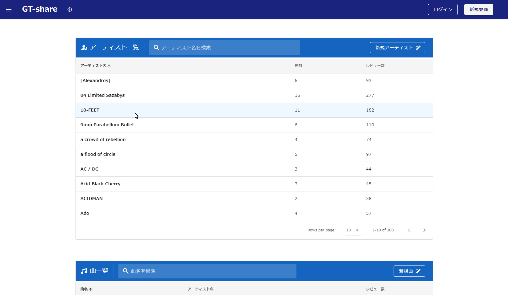

- 入力した文字と一致するアーティスト名を検索できます。

    

- 新規アーティスト名を追加できます。

    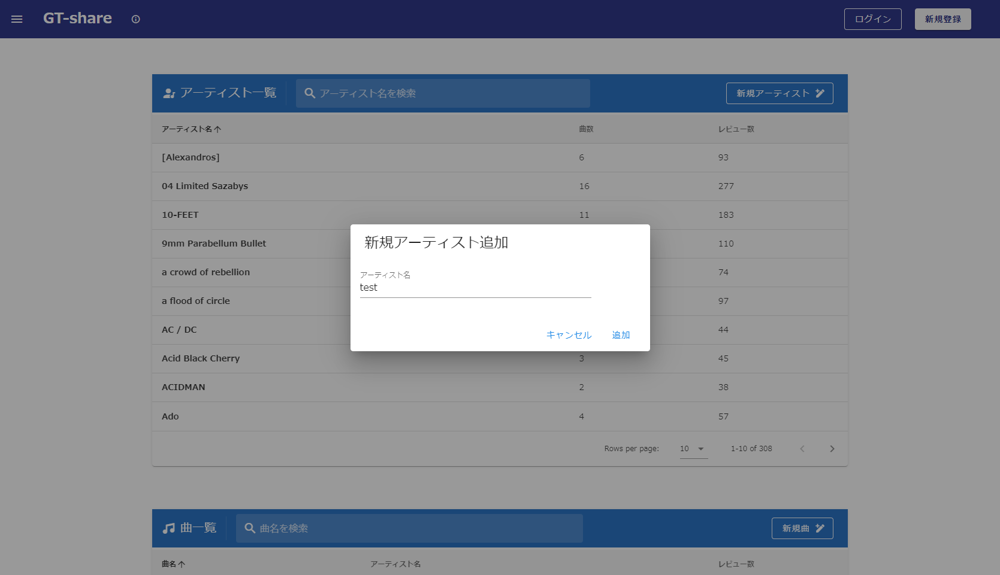

### 曲名一覧表示
- クリックするとレビュー一覧画面へ移動します。
- 検索、並び替え、曲名追加が可能です。

    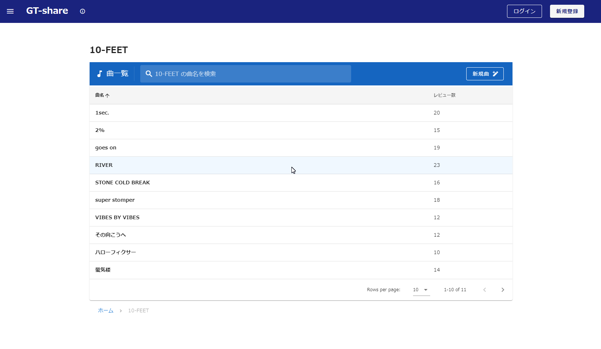

### レビュー一覧表示
- レビューの評価をレーダーチャートを用いて視覚的にわかりやすく表示しました。
- 新規投稿、いいね、レビュー並び替えができます。

    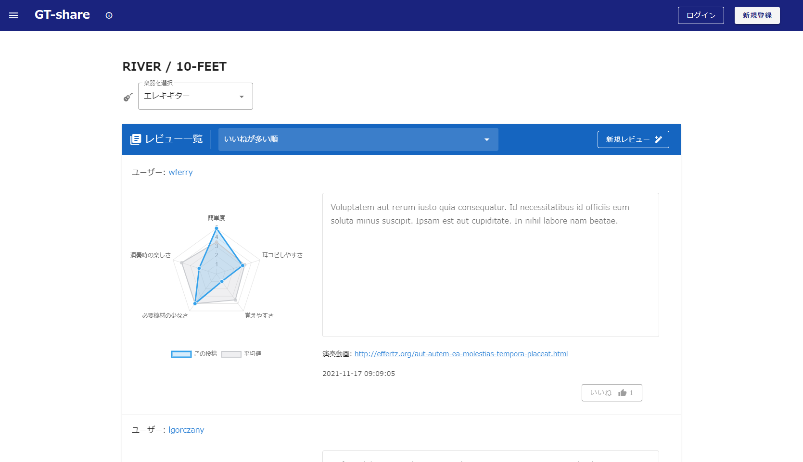

- 楽器ごとにレビューを表示します。

    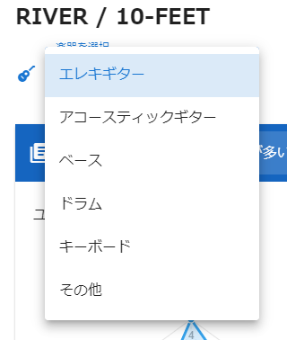

- 新規レビューボタンをクリックすると投稿ダイアログが表示されます。

    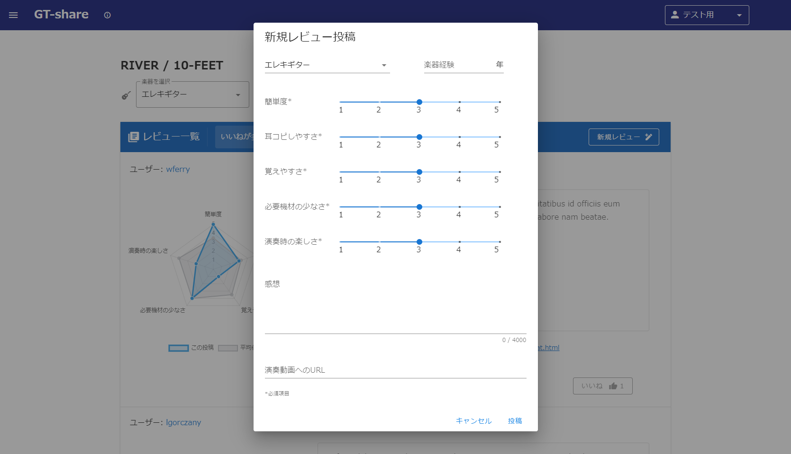

- 自分が投稿したレビューは編集・削除が可能です。

    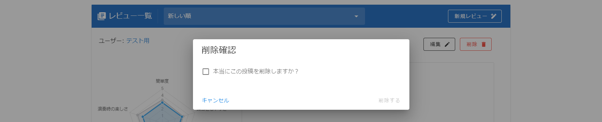

### ユーザー登録・ログイン機能
- 画面右上のボタンをクリックすると新規登録・ログインダイアログが表示されます。
- Googleアカウントでのログインも可能です。

    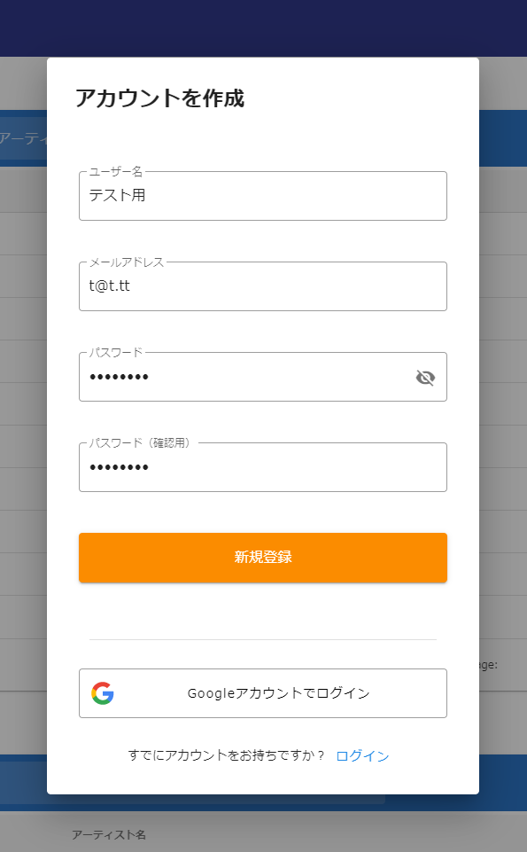
    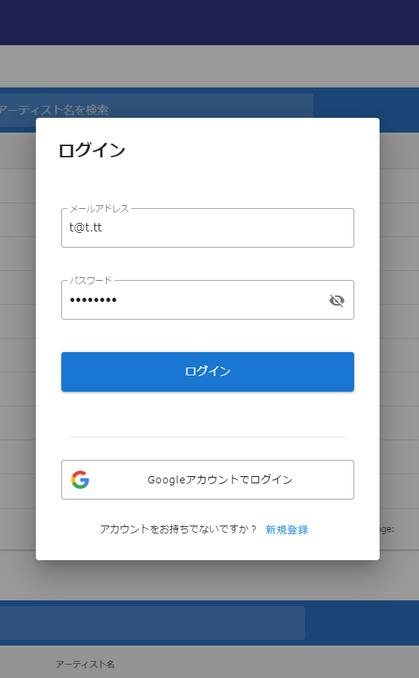

### ユーザーメニュー
- ログイン中に画面右上のボタンをクリックすると、ユーザーメニューが表示されます。
- ログアウトなどの機能を利用可能です。

    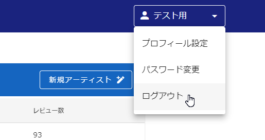

### ナビゲーションメニュー
- 画面左上のアイコンをクリックするとナビゲーションメニューが開きます。

    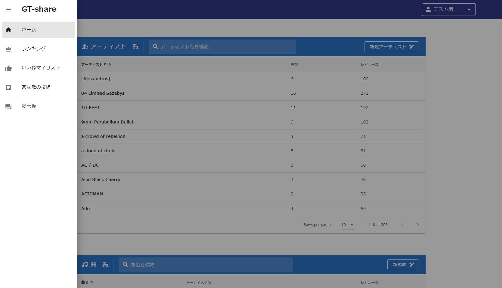

### ランキング機能
- 楽器初心者のユーザー向けに、簡単な曲をランキング形式で表示します。
- 楽器ごとに表示を切り替えられます。

    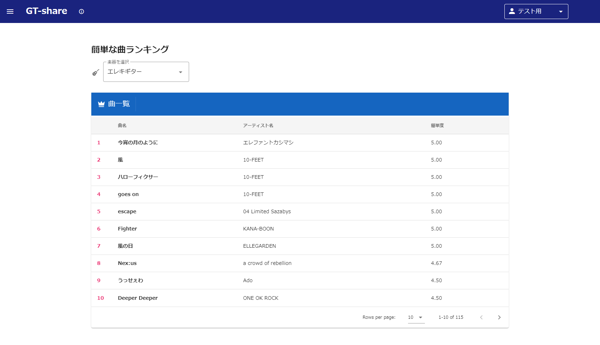

### いいねマイリスト
- 自分がいいねを押したレビューを見返すことができます。

    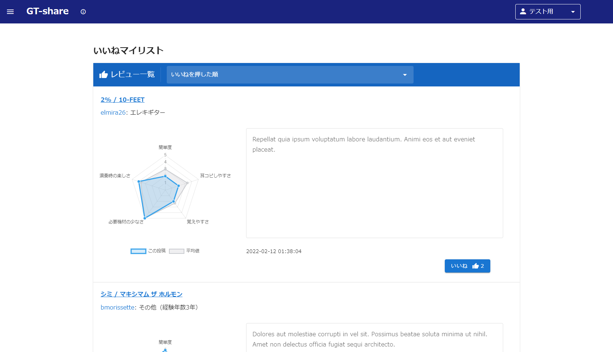

### 自分の投稿一覧表示
- 自分が過去に投稿したレビューを振り返ることができます。

    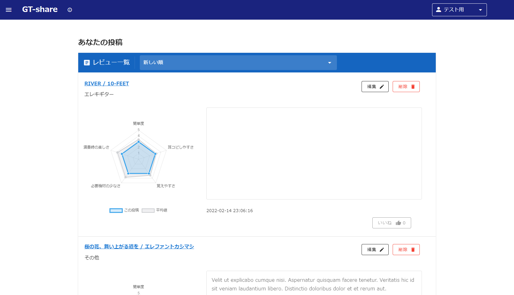

### 今後追加したい機能
- 掲示板機能（現在開発中）
- スマホ画面へのレスポンシブ対応
- Vuexを用いたログイン状態の管理

## 開発環境
#### OS
- Amazon Linux バージョン2

#### フロントエンド
- HTML/CSS
- Vue v2.5.17
- Vuetify v2.6.2
- Vue-Chartjs v3.5.1

#### バックエンド
- PHP v8.0.13
- Laravel v6.20.44

#### データベース
- MariaDB v10.2.38

#### インフラ
- AWS (Cloud9)

#### デプロイ
- Heroku

## テーブル定義

    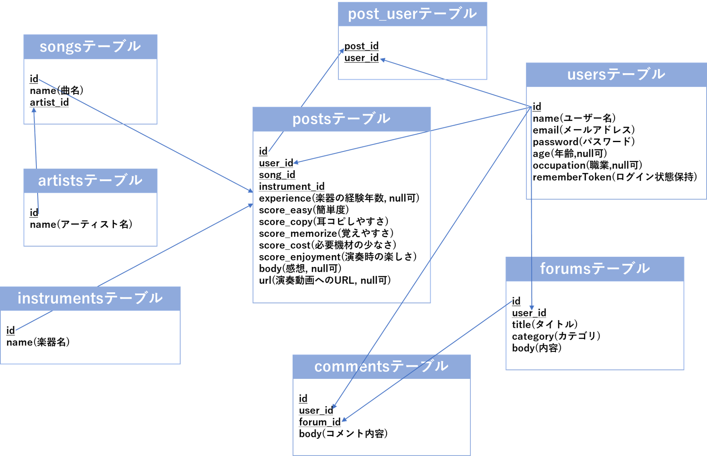

### usersテーブル
|  カラム名  |  データ型  |  詳細  |
| ---- | ---- | ---- |
|  id  |  bigint(20) unsigned  |  ID  |
|  name  |  varchar(255)  |  ユーザー名  |
|  email  |  varchar(255)  |  メールアドレス  |
|  password  |  varchar(255)  |  パスワード  |
|  age  |  tinyint(3) unsigned  |  年齢  |
|  occupation  |  varchar(255)  |  職業  |
|  rememberToken  |  varchar(100)  |  ログイン状態を保持  |
|  created_at  |  timestamp  |  データ作成時間  |
|  updated_at |  timestamp  |  データ更新時間  |

### artistsテーブル
|  カラム名  |  データ型  |  詳細  |
| ---- | ---- | ---- |
|  id  |  int(10) unsigned  |  ID  |
|  name  |  varchar(255)  |  アーティスト名  |
|  created_at  |  timestamp  |  データ作成時間  |
|  updated_at |  timestamp  |  データ更新時間  |

### songsテーブル
|  カラム名  |  データ型  |  詳細  |
| ---- | ---- | ---- |
|  id  |  smallint(5) unsigned  |  ID  |
|  name  |  varchar(255)  |  曲名  |
|  artist_id  |  int(10) unsigned  |  artistsテーブルとの連携用ID  |
|  created_at  |  timestamp  |  データ作成時間  |
|  updated_at |  timestamp  |  データ更新時間  |

### instrumentsテーブル
|  カラム名  |  データ型  |  詳細  |
| ---- | ---- | ---- |
|  id  |  smallint(5) unsigned  |  ID  |
|  name  |  varchar(255)  |  楽器名  |
|  created_at  |  timestamp  |  データ作成時間  |
|  updated_at |  timestamp  |  データ更新時間  |

### postsテーブル
|  カラム名  |  データ型  |  詳細  |
| ---- | ---- | ---- |
|  id  |  bigint(20) unsigned  |  ID  |
|  user_id  |  bigint(20) unsigned  |  usersテーブルとの連携用ID  |
|  song_id  |  smallint(5) unsigned  |  songsテーブルとの連携用ID  |
|  instrument_id  |  smallint(5) unsigned  |  instrumentsテーブルとの連携用ID  |
|  experience  |  tinyint(3) unsigned  |  楽器の経験年数  |
|  score_easy  |  tinyint(3) unsigned  |  簡単度  |
|  score_copy  |  tinyint(3) unsigned  |  耳コピしやすさ  |
|  score_memorize  |  tinyint(3) unsigned  |  覚えやすさ  |
|  score_cost  |  tinyint(3) unsigned  |  必要機材の少なさ  |
|  score_enjoyment  |  tinyint(3) unsigned  |  演奏時の楽しさ  |
|  body  |  text  |  感想  |
|  url  |  varchar(255)  |  演奏動画へのURL  |
|  created_at  |  timestamp  |  データ作成時間  |
|  updated_at |  timestamp  |  データ更新時間  |

### post_userテーブル（いいね機能用の中間テーブル）
|  カラム名  |  データ型  |  詳細  |
| ---- | ---- | ---- |
|  user_id  |  bigint(20) unsigned  |  usersテーブルとの連携用ID  |
|  post_id  |  bigint(20) unsigned  |  postsテーブルとの連携用ID  |
|  created_at  |  timestamp  |  データ作成時間  |
|  updated_at |  timestamp  |  データ更新時間  |
