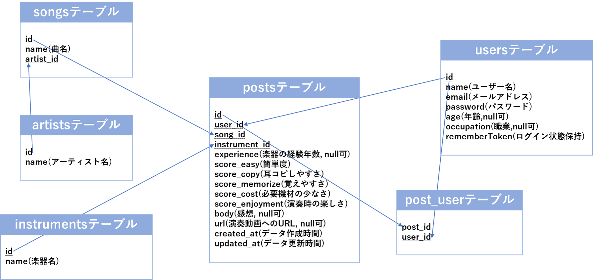

# GT-share
「楽器演奏者のための**楽曲レビューサイト**」です。\
ユーザーは演奏したことのある楽曲についてレビューを投稿することができます。\
また、評価が気になる楽曲について検索し、そのレビューを閲覧することが可能です。

#### 紹介動画

#### URL
https://gtshare.herokuapp.com

#### テスト用アカウント
メールアドレス: `t@t.tt`\
パスワード: `tttt1234`

## 作成した背景/目的

私は9年前にエレキギターを弾き始め、高校や大学でバンド活動を行ってきました。初めは独学だったため伸び悩んでおりましたが、バンドの先輩から演奏のコツを教えてもらうようになると一気に上達し始め、ずっと弾けなかった曲も演奏できるようになりました。

このことから、楽器上達には経験者からの情報が必要であると実感し、気軽に情報共有できる場を設けるために本アプリケーションを作成しました。

## 機能一覧
- [アーティスト名一覧表示機能](#アーティスト名一覧表示機能)
- [曲名一覧表示機能](#曲名一覧表示機能)
- [楽器カテゴリ別レビュー一覧表示機能](#楽器カテゴリ別レビュー一覧表示機能)
- [レビュー投稿機能](#レビュー投稿機能)
- [ランキング機能](#ランキング機能)
- [ユーザー登録、ログイン機能](#ユーザー登録、ログイン機能)
- [いいね機能](#いいね機能)
- [いいねを押したレビュー一覧表示機能](#いいねを押したレビュー一覧表示機能)
- [自分が投稿したレビュー一覧表示機能](#自分が投稿したレビュー一覧表示機能)

###アーティスト名一覧表示機能
- クリックすると曲名一覧ページへ移動します。
- アーティスト名検索、並び替え、新規アーティストの追加ができます。

    

### 曲名一覧表示機能
- クリックするとレビュー一覧ページへ移動します。

### レビュー投稿機能

### 楽器カテゴリ別レビュー一覧表示機能
- 楽器ごとにレビューを表示できます。
- いいね数、投稿日時で並び替えができます。

### ランキング機能
- 楽器初心者のユーザー向けに、簡単な曲をランキング形式で表示します。

### ユーザー登録、ログイン機能
- Googleアカウントでのログインも可能です。

### いいね機能

### いいねを押したレビュー一覧表示機能

### 自分が投稿したレビュー一覧表示機能

## 開発環境
#### OS
- Amazon Linux バージョン2

#### フロントエンド
- HTML/CSS
- Vue v2.5.17
- Vuetify v2.6.2
- Vue-Chartjs v3.5.1

#### バックエンド
- PHP v8.0.13
- Laravel v6.20.44

#### データベース
- MariaDB v10.2.38

#### インフラ
- AWS (Cloud9)

#### デプロイ
- Heroku

## 実行手順

## テーブル定義

    

### usersテーブル
|  カラム名  |  データ型  |  詳細  |
| ---- | ---- | ---- |
|  id  |  bigint(20) unsigned  |  ID  |
|  name  |  varchar(255)  |  ユーザー名  |
|  email  |  varchar(255)  |  メールアドレス  |
|  password  |  varchar(255)  |  パスワード  |
|  age  |  tinyint(3) unsigned  |  年齢  |
|  occupation  |  varchar(255)  |  職業  |
|  rememberToken  |  varchar(100)  |  ログイン状態を保持  |
|  created_at  |  timestamp  |  データ作成時間  |
|  updated_at |  timestamp  |  データ更新時間  |

### artistsテーブル
|  カラム名  |  データ型  |  詳細  |
| ---- | ---- | ---- |
|  id  |  int(10) unsigned  |  ID  |
|  name  |  varchar(255)  |  アーティスト名  |
|  created_at  |  timestamp  |  データ作成時間  |
|  updated_at |  timestamp  |  データ更新時間  |

### songsテーブル
|  カラム名  |  データ型  |  詳細  |
| ---- | ---- | ---- |
|  id  |  smallint(5) unsigned  |  ID  |
|  name  |  varchar(255)  |  曲名  |
|  artist_id  |  int(10) unsigned  |  artistsテーブルとの連携用ID  |
|  created_at  |  timestamp  |  データ作成時間  |
|  updated_at |  timestamp  |  データ更新時間  |

### instrumentsテーブル
|  カラム名  |  データ型  |  詳細  |
| ---- | ---- | ---- |
|  id  |  smallint(5) unsigned  |  ID  |
|  name  |  varchar(255)  |  楽器名  |
|  created_at  |  timestamp  |  データ作成時間  |
|  updated_at |  timestamp  |  データ更新時間  |

### postsテーブル
|  カラム名  |  データ型  |  詳細  |
| ---- | ---- | ---- |
|  id  |  bigint(20) unsigned  |  ID  |
|  user_id  |  bigint(20) unsigned  |  usersテーブルとの連携用ID  |
|  song_id  |  smallint(5) unsigned  |  songsテーブルとの連携用ID  |
|  instrument_id  |  smallint(5) unsigned  |  instrumentsテーブルとの連携用ID  |
|  experience  |  tinyint(3) unsigned  |  楽器の経験年数  |
|  score_easy  |  tinyint(3) unsigned  |  簡単度  |
|  score_copy  |  tinyint(3) unsigned  |  耳コピしやすさ  |
|  score_memorize  |  tinyint(3) unsigned  |  覚えやすさ  |
|  score_cost  |  tinyint(3) unsigned  |  必要機材の少なさ  |
|  score_enjoyment  |  tinyint(3) unsigned  |  演奏時の楽しさ  |
|  body  |  text  |  感想  |
|  url  |  varchar(255)  |  演奏動画へのURL  |
|  created_at  |  timestamp  |  データ作成時間  |
|  updated_at |  timestamp  |  データ更新時間  |

### post_userテーブル（いいね機能用の中間テーブル）
|  カラム名  |  データ型  |  詳細  |
| ---- | ---- | ---- |
|  user_id  |  bigint(20) unsigned  |  usersテーブルとの連携用ID  |
|  post_id  |  bigint(20) unsigned  |  postsテーブルとの連携用ID  |
|  created_at  |  timestamp  |  データ作成時間  |
|  updated_at |  timestamp  |  データ更新時間  |
